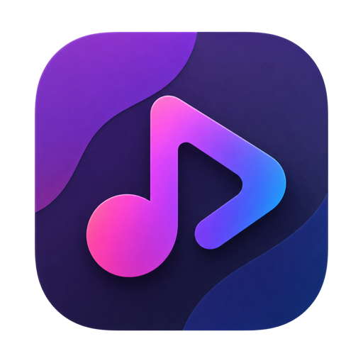
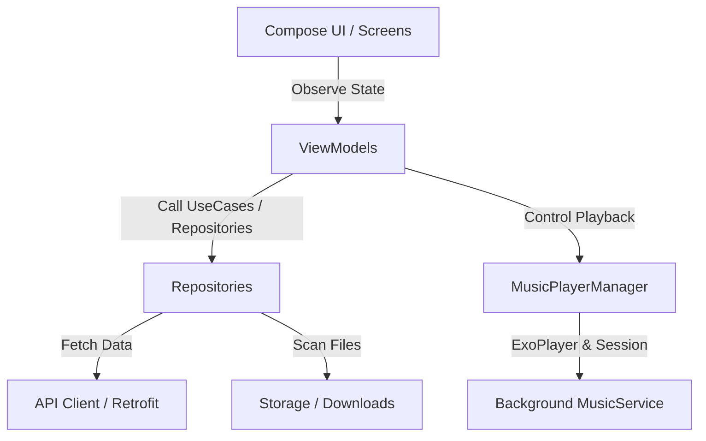

# MyMusic

<p align="center">
  
</p>

**MyMusic** is a high-fidelity, feature-rich music streaming and downloading application for Android. Built with a modern Android tech stack, the app integrates with an online music API to deliver seamless streaming, background audio playback with lock-screen control, high-speed offline downloads, and an adaptive Material 3 Jetpack Compose interface.

---

## 📥 Download

You can download the latest pre-compiled stable APK directly from the **GitHub Releases** section:

* 🚀 **[Download Latest APK](https://github.com/KamalMahanna/MyMusic/releases/latest)** (Includes the latest stable features)
* 📦 **[View All Releases](https://github.com/KamalMahanna/MyMusic/releases)** (For access to historical builds and changelogs)

---

## 🚀 Key Features

* **🎵 High-Quality Online Streaming:** Discover and stream millions of tracks, albums, playlists, and artists in high resolution via integrated [API client](app/src/main/java/com/mymusic/app/data/api/SaavnApi.kt).
* **📻 System-Integrated Playback:** A foreground audio service built on **AndroidX Media3 (ExoPlayer & MediaSession)**, supporting lock screen media controls, background playback, system notification integration, and audio focus handling. Implemented in [MusicService](app/src/main/java/com/mymusic/app/player/MusicService.kt) and [MusicPlayerManager](app/src/main/java/com/mymusic/app/player/MusicPlayerManager.kt).
* **📥 Offline Downloads:** High-speed song downloader ([SongDownloader](app/src/main/java/com/mymusic/app/download/SongDownloader.kt)) that saves files directly to the public `Music/MyMusic` directory, allowing other players to index downloaded music and supporting local playback via [DownloadRepository](app/src/main/java/com/mymusic/app/data/repository/DownloadRepository.kt).
* **🔀 Smart Queue & Playback Management:** Queue persistence, shuffle, repeat-one, repeat-all, and smooth seek features, managed efficiently via [QueueManager](app/src/main/java/com/mymusic/app/player/QueueManager.kt).
* **⚡ Smart Offline Cache:** Reduces network consumption for streaming by utilizing custom network caching policies on OkHttp, along with a dedicated [StreamingCacheManager](app/src/main/java/com/mymusic/app/player/StreamingCacheManager.kt).
* **🎨 Responsive Jetpack Compose UI:** Premium design with glassmorphism, dynamic animations, modern color schemes, and seamless layout transitions.
* **📱 Adaptive Layouts:** Adapts to multiple screen form factors: uses a bottom navigation bar on phones and an elegant navigation rail on tablets or foldables ([NavGraph.kt](app/src/main/java/com/mymusic/app/ui/navigation/NavGraph.kt)).

---

## 🛠️ Architecture & Tech Stack

MyMusic adheres to modern Android architecture principles (**Clean Architecture** & **MVI/MVVM UI state patterns**).



### Technical Specs

* **Minimum SDK:** 24 (Android 7.0)
* **Target/Compile SDK:** 35 (Android 15)
* **Language:** Kotlin (JVM Target 17)
* **Dependency Injection:** Dagger Hilt (`@HiltAndroidApp` in [MyMusicApp](app/src/main/java/com/mymusic/app/MyMusicApp.kt))
* **Network:** Retrofit + OkHttp with aggressive caching rules in [AppModule](app/src/main/java/com/mymusic/app/di/AppModule.kt).
* **JSON Parsing:** Moshi + Moshi Kotlin Codegen.
* **Image Loading:** Coil 3 featuring OkHttp integration and a robust 1GB local disk cache.
* **Audio Engine:** AndroidX Media3 (ExoPlayer, MediaSession, MediaLibraryService).

---

## 📂 Project Structure Guide

```
MyMusic/
├── app/
│   └── src/main/java/com/mymusic/app/
│       ├── MainActivity.kt        # Entry point activity initializing MyMusicTheme
│       ├── MyMusicApp.kt       # Application class setting up Coil 3 and Dagger Hilt
│       ├── data/                  # Data layer (APIs, repositories, and models)
│       │   ├── api/               # API clients and data models
│       │   ├── model/             # Models for Songs, Artists, Playlists
│       │   └── repository/        # Download & Music repository interfaces
│       ├── di/                    # Dependency Injection modules (Hilt)
│       ├── download/              # High-speed Downloader implementing download logic
│       ├── player/                # ExoPlayer integration, background service, queue
│       └── ui/                    # UI layer
│           ├── components/        # Reusable Compose widgets (MiniPlayer, indicators)
│           ├── navigation/        # App navigation graphs and route configurations
│           ├── screens/           # Main screen UI (Home, Library, Player, Search)
│           └── theme/             # Design Tokens, Color Scheme, and Typography
├── gradle/
│   └── libs.versions.toml         # Centralized Gradle dependency catalog
└── logo.png                       # Application launcher/branding logo
```

---

## 🏁 Getting Started

### Prerequisites

Make sure you have:

1. **JDK 17** installed and configured.
2. **Android Studio** (Ladybug or newer recommended).
3. **Android SDK 35** installed via Android Studio SDK Manager.

### Building the Project

Clone the repository, open it in Android Studio, or compile it from the command line:

```bash
# Clean the project build directories
./gradlew clean

# Build a debug APK
./gradlew assembleDebug

# Run unit tests
./gradlew test
```

### Keystore Configuration (Release Builds)

To run a release build, configure the signing details by setting the following environment variables:

* `KEYSTORE_PATH`: Absolute path to your `.keystore` file.
* `KEYSTORE_PASSWORD`: Keystore security password.
* `KEY_ALIAS`: Key certificate alias name.
* `KEY_PASSWORD`: Key security password.

---

## ⚖️ Disclaimer & Legal Notice

This project is created strictly for **personal, educational, and research purposes**.

* **No Commercial Intent:** This is a non-commercial, open-source project. It does not generate revenue, run advertisements, or charge users in any form.
* **No Harm or Business Disruption:** There is absolutely no motive or intention to harm, disrupt, compete with, or reduce the business of any official music streaming service or API provider. It is built as a personal portfolio project demonstrating media playback integrations on Android.
* **Copyright Ownership:** All music tracks, metadata, album artwork, and streaming media accessed through third-party endpoints are the exclusive property of their respective copyright owners and official streaming platforms. This repository does not host, store, or distribute any copyrighted media files.
* **Terms of Use:** This software is provided "as is" without warranty of any kind. Users who run or modify this application do so at their own risk and are responsible for complying with the terms of service of any external APIs used.
